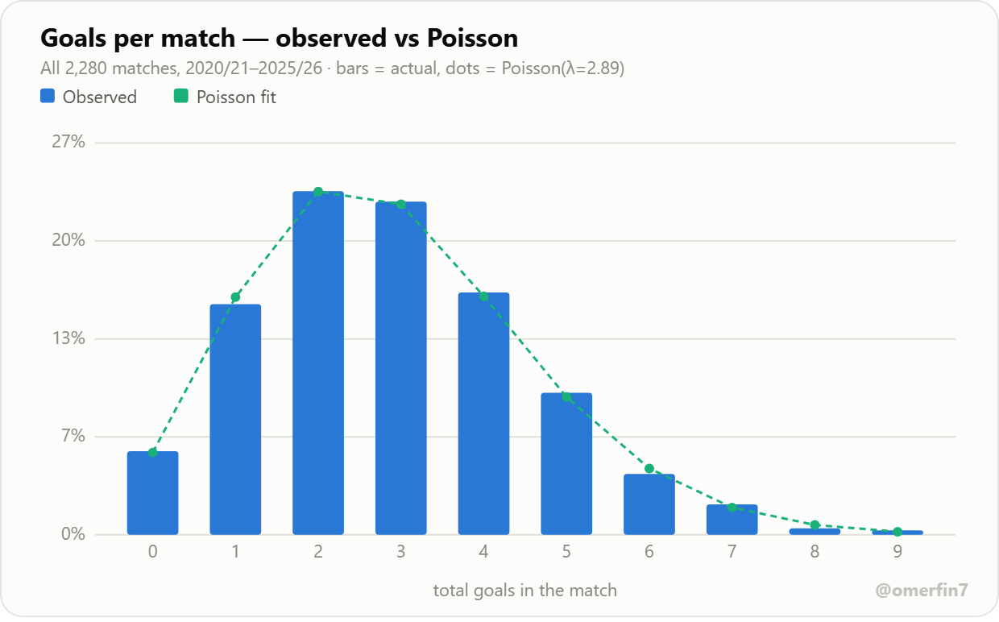
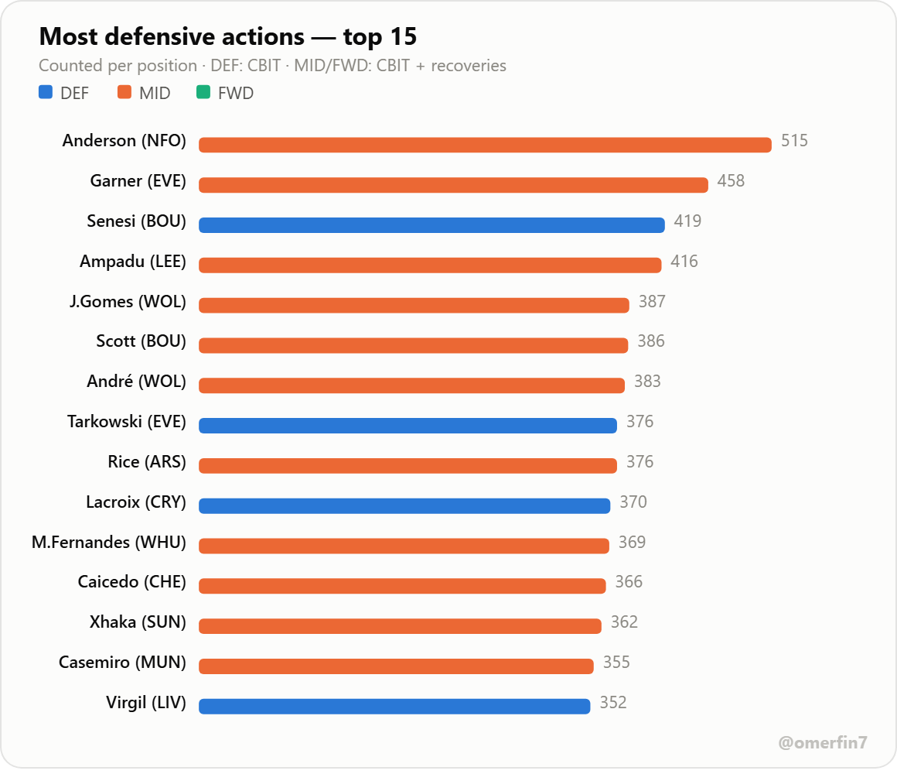
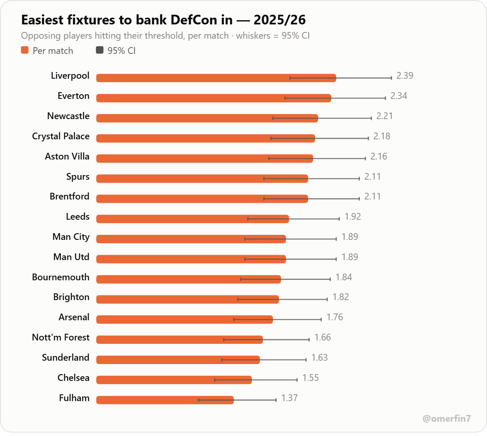
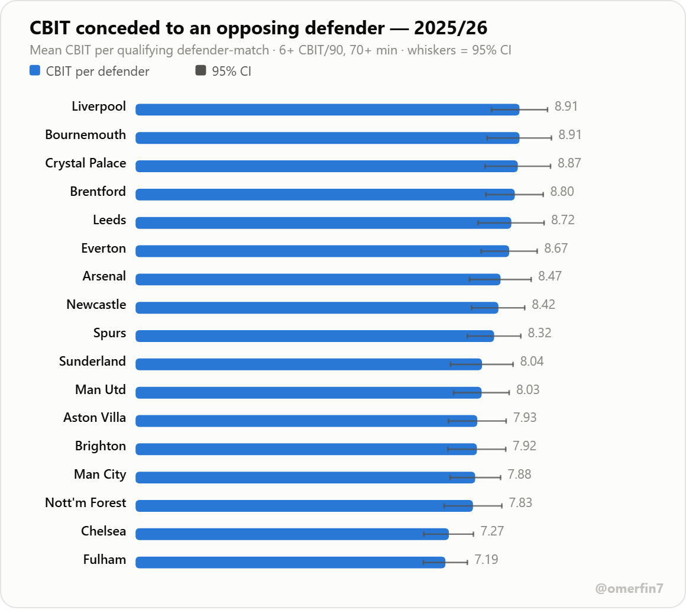
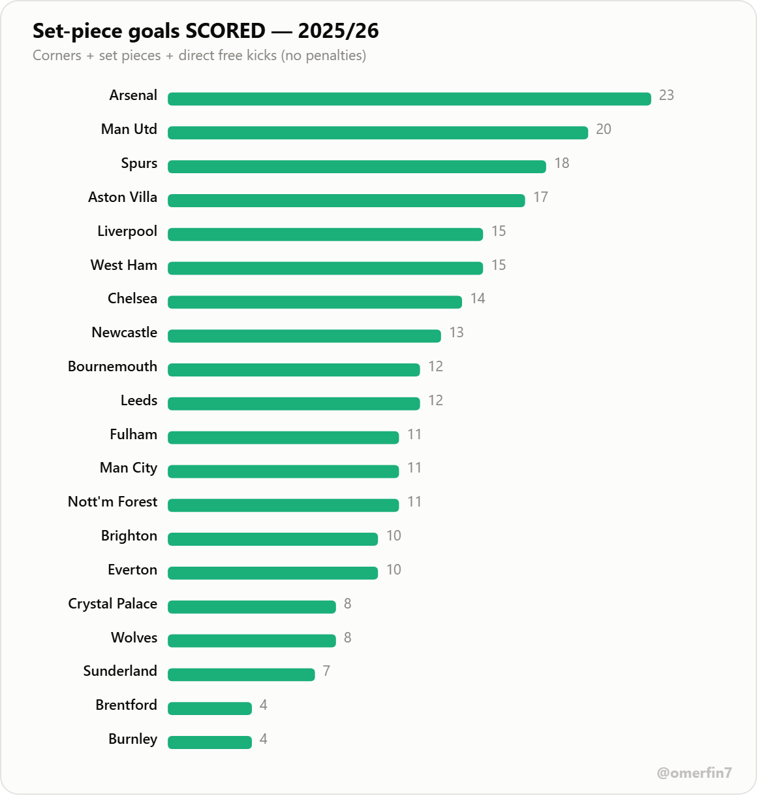
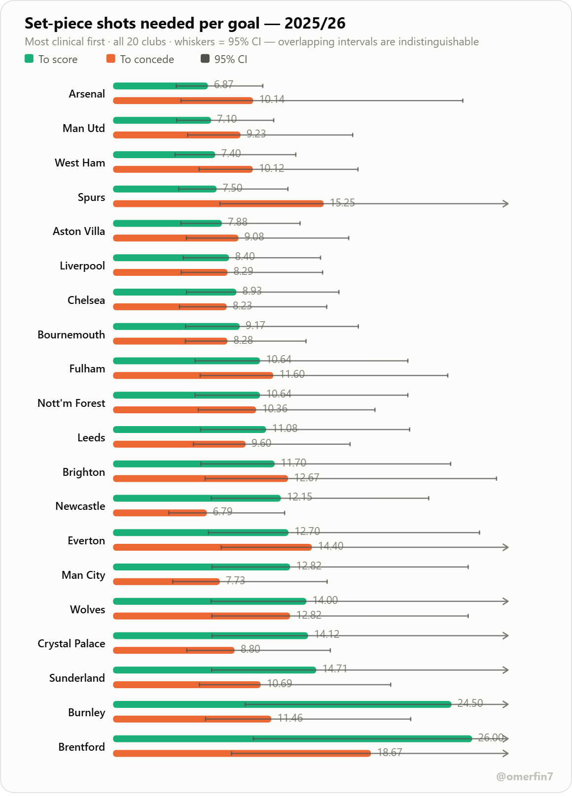

# Premier League Defensive Trends — 2020/21 → 2025/26

A six-season study of **defensive performance in the English Premier League**, built for Fantasy Premier League (FPL) decision-making: clean sheets, goals conceded, home/away splits, and where the best defensive value sits going into and through **2025/26**.

> **Now updated for the 2025/26 season.** All 380 matches of 2025/26 are included.

**➡️ View the interactive dashboard** — download **[`docs/index.html`](docs/index.html)** (open it → **Download raw file**) and open it in any browser. It is fully self-contained and works offline. &nbsp;·&nbsp; [Read the findings report](REPORT.md)

> **Prefer a hosted link?** Enable GitHub Pages once — **Settings → Pages → Source: _Deploy from a branch_ → `main` / `/docs` → Save** — and the dashboard goes live at `https://omerfinzi.github.io/PL_defensive-_trends/` (it 404s until Pages is enabled). The static charts below preview it either way.


---

## Sample visuals

A few charts from the dashboard (each is a self-contained, shareable image). The full set is interactive — with tooltips, a light/dark toggle and sortable tables — in [`docs/index.html`](docs/index.html) (see how to open it above).

| | |
|---|---|
|  |  |
|  |  |

**Goals per match — the distribution, against a fitted Poisson**



**DefCon points banked — 2025/26 (new player-level metric)**


**Most defensive actions — counted per position (defenders on CBIT; midfielders and forwards on CBIT + recoveries)**



**Which fixtures hand out DefCon — opposing threshold-hitters per match, 17 clubs staying up**



**The same question at CBIT level — how much defensive work an opposing defender does, rather than whether he crossed the bonus line**



**Set pieces — corners won vs conceded, 2025/26 (penalties excluded)**


**Set-piece goals scored — 2025/26 (corners + set pieces + direct free kicks, no penalties)**



**Set-piece efficiency — shots needed per goal, every team**



---

## Headline findings (2025/26)

- **Defences are recovering.** After the goal-glut of 2023/24 (3.28 goals/game, 62% both-teams-to-score — the highest of the six seasons studied), scoring has fallen two seasons running. **2025/26 is the meanest season for goals since 2020/21** — 2.75 goals/game and clean sheets back up to 0.51 per game.
- **Goals per match follow a Poisson distribution.** Fitted across all 2,280 matches with λ = 2.89 — the observed mean, and the distribution's only parameter — the goodness-of-fit test gives χ² = 2.4 on 7 df, **p = 0.94**. What makes that more than curve-fitting is that with λ fixed there is nothing left to tune, yet Poisson also predicts the spread and the shape correctly: variance ÷ mean comes to **0.98** where it requires exactly 1.00, and skew is **0.53** against a predicted 1/√λ = 0.59. Poisson is not rejected in any individual season either (weakest: 2020/21 at p = 0.11). **The payoff:** a clean sheet is just P(0) = e^−λ, so clean-sheet rate follows from goals conceded per game with nothing else fitted — accurate to **3.7 percentage points** across all 120 team-seasons here (Arsenal's 0.71 conceded/gm implies 49.1% clean sheets; they recorded 50.0%).
- **1–1 is the most likely scoreline** in a Premier League match — 11.0% of all games, and the modal result in five of six seasons (2022/23 went to 1–0 on 12.1%). Only 1 match in 18 finishes 0–0. Every mirrored pair leans home, which *is* home advantage: 1–0 beat 0–1 by 189 to 167, 2–1 beat 1–2 by 187 to 159.
- **Arsenal are the defence to own** — a **50% clean-sheet rate** and just **0.71 goals conceded per game**, the best single-season return **since 2021/22**, when Man City and Liverpool both went 55% / 0.68. Man City are second this season (42% CS, 0.92 conceded/gm); after that there's a steep drop-off.
- **The home clean-sheet edge is real but noisy.** Home sides kept more clean sheets than away sides in five of the six seasons, and 2025/26 is one of them (28% vs 23%). But it is not a clean trend: the gap was near zero in 2020/21 (the behind-closed-doors season), peaked in 2022/23, and **inverted in 2024/25**, when away teams shut opponents out slightly more often. Home advantage measured in *points* per game recovers more convincingly — a different metric from clean sheets.
- **Momentum matters.** Biggest defensive *improvers* vs 2024/25: **Brighton (−0.34 conceded/gm)**, Man City, Spurs, Arsenal. Biggest *declines*: **Liverpool (+0.32)**, Chelsea, then Newcastle and Bournemouth tied (+0.21 each).
- **Promoted-side watch.** **Sunderland** were a genuine defensive surprise (29% CS, 1.26 conceded/gm); Leeds (21%) held up moderately; Burnley struggled (11% CS, 1.97 conceded/gm).
- **DefCon points (new 2025/26 scoring metric).** **Elliot Anderson (NFO)** and **Marcos Senesi (BOU)** tied on a league-leading **52 DefCon points** (26 threshold-hit matches each). Defenders banked **1,642** DefCon points to midfielders' **1,174**; forwards essentially none. The hardest-working defensive squads were **Everton, Bournemouth and Burnley** — often the busier, deeper-defending sides. Best budget value: **Maxime Estève (BUR, £3.8m)** and **Senesi** at ~10 DefCon points per £m.
- **DefCon is a fixture play, not just a player play.** The number of *opposing* players who reach their DefCon threshold varies by more than 2× depending on who they are facing. Facing **Liverpool** produced **2.39** threshold-hitters per match; facing **Fulham**, just **1.37** — and those two ends do not overlap even at 95% confidence. Everton (2.34), Newcastle (2.21) and Crystal Palace (2.18) round out the most generous fixtures. Notably this is *not* simply "the big possession sides": Man City sit 9th of 17 and Arsenal 13th, so it is not explained by attacking volume (correlation with goals scored is only +0.26). Restricted to the 17 clubs staying up, since a fixture against a relegated side is not one you can plan around.
- **At CBIT level the same fixture effect holds, but smaller.** Measuring *how much* rather than *whether*: a qualifying opposing defender racks up **8.91 CBIT** against Liverpool and Bournemouth versus **7.19** against Fulham. That is a 1.24× spread rather than the 1.7× of the bonus count — averaging compresses what a threshold amplifies, and both are honest descriptions of the same thing. Restricted to regular defensive contributors (6+ CBIT per 90 across the season, 145 players) playing 70+ minutes, which roughly **doubles** the metric's season-to-season stability versus using every defender. Venue is worth more than most of the table: facing a club at *their* ground adds about **+0.58 CBIT**.
- **Set pieces (corners & free kicks, penalties excluded).** **Man City** won the most corners (6.5/game); **West Ham** faced the most (6.11/game). League-wide corners have held steady (~10 per match across six seasons). Designated set-piece specialists doing *both* corners and direct free kicks include **Rice (Arsenal)**, **Ward-Prowse (Burnley)**, **Reece James (Chelsea)**, **Bruno Fernandes (Man Utd)** and **Bowen (West Ham)**.
- **Set-piece goals (2025/26, via Understat).** **Arsenal have scored 23 goals from set pieces** (corners + set pieces + direct free kicks, no penalties) — comfortably the league's most, three clear of Man Utd's 20. They also top the efficiency table at **6.9 shots per goal**, but only just: Man Utd are at 7.1 and the two clubs' confidence intervals overlap almost entirely, so the defensible claim is *volume*, not superior finishing. **Bournemouth have conceded the most (18)**. The clear efficiency gap is at the bottom — Brentford and Burnley managed 4 set-piece goals each, needing 24–26 shots per goal, roughly 3.5× Arsenal's rate.
- **Set-piece efficiency, every team.** The dashboard now shows, for all 20 clubs: how many set-piece shots they need to score once, and how many their opponents need to score against them (higher = harder to breach = better defense). Extremes: **Arsenal need just 6.9 shots per goal to score** (best attack), **Brentford need 26** (worst attack); **Brentford are the hardest team to score against from set pieces (opponents need 18.7 shots per goal)**, **Newcastle are the easiest to breach (just 6.8)** — so Brentford pair a weak set-piece attack with an excellent set-piece defense, while Newcastle's set-piece defense is a genuine soft spot despite mid-table attacking output.

Full numbers and charts are in the dashboard ([`docs/index.html`](docs/index.html)) and [REPORT.md](REPORT.md).

---

## What's in the repo

```
data/                 six season match-results CSVs (epl-2020.csv … epl-2025.csv)
data/fpl_2025_26/      player-level FPL source for DefCon + set-piece takers
data/football_data/    football-data.co.uk CSVs (corners, six seasons)
analyze.py            match-results pipeline → docs/data.json + outputs/
defcon.py             2025/26 DefCon (player-level) pipeline → docs/defcon.json
setpieces.py          set-piece pipeline (corners + takers) → docs/setpieces.json
fetch_setpiece_goals.py  set-piece GOALS from Understat → docs/setpieces_goals.json (run locally, see below)
build_dashboard.py    builds the self-contained docs/index.html from the JSONs
tools/export_examples.js  regenerates the README preview PNGs from the built dashboard
docs/index.html       the interactive dashboard (GitHub Pages entry point)
docs/data.json        league/team metrics consumed by the dashboard
docs/defcon.json      player-level DefCon metrics
docs/setpieces.json   set-piece corners + takers
docs/setpieces_goals.json  set-piece goals for/against + efficiency (created by fetch_setpiece_goals.py)
outputs/              team_season_defence.csv (tidy per-team-per-season table)
REPORT.md             written findings report
.claude/skills/       project skill describing the data sources
```

## Reproduce it

Requires Python 3 with `pandas` and `numpy`.

```bash
pip install pandas numpy
python analyze.py          # league/team trends   -> docs/data.json + outputs/
python defcon.py           # 2025/26 player DefCon -> docs/defcon.json
python setpieces.py        # set pieces (corners+takers) -> docs/setpieces.json
python fetch_setpiece_goals.py   # set-piece GOALS from Understat -> docs/setpieces_goals.json  (run from a normal network — see note)
python build_dashboard.py  # rebuilds docs/index.html from the JSONs
```

### Refreshing the preview images

The PNGs in [`docs/examples/`](docs/examples/) are screenshots, so they go stale silently whenever a chart's title, label or numbers change. Regenerate them all in one command after `build_dashboard.py`:

```bash
node tools/export_examples.js       # needs Node + Chrome or Edge (or set CHROME_PATH)
```

It runs the dashboard's **own** chart code out of `docs/index.html` under a small DOM shim, serializes each chart to a standalone SVG, and screenshots it at 2× — so the images cannot drift from what the dashboard actually draws. The only thing that can go out of date is the chart list at the top of that file, and it exits non-zero if a listed chart is missing.

### Set-piece goals (2025/26) — refreshing it later

The **"who scores / concedes most from set pieces"** block uses `docs/setpieces_goals.json` (already committed with real 2025/26 numbers), which pulls goals-by-situation (corners + set pieces + direct free kicks, **penalties excluded**) plus **efficiency** = set-piece shots per goal, from **[Understat](https://understat.com)**.

⚠️ **To refresh it for a future gameweek/season:** [`fetch_setpiece_goals.py`](fetch_setpiece_goals.py) automates this but Understat blocks server/datacenter IPs (as do FBref/Sofascore/FotMob and every public proxy tried) — including the sandbox this project was built in. The reliable workaround, confirmed working: open any `understat.com` page in a normal browser and run the fetch **client-side from the Console** (loads each club via a hidden `<iframe>`, which Understat serves in full), then save the downloaded JSON into `docs/`. Ask an AI assistant for the Console snippet if you need it regenerated, or adapt `fetch_setpiece_goals.py`'s logic. Once `docs/setpieces_goals.json` is updated, re-run `build_dashboard.py`.

Open `docs/index.html` in any browser — it is fully self-contained (data embedded inline, **zero external requests**, works offline and on GitHub Pages).

## Data sources

- **League & team trends:** [fixturedownload.com](https://fixturedownload.com) — one EPL results CSV per season, identical schema every year, so seasons stay directly comparable. Add a future season by dropping `epl-<startyear>.csv` into `data/` and re-running (the pipeline globs `data/epl-*.csv`).
- **DefCon (player-level, 2025/26):** official FPL season-end stats via the community archive [vaastav/Fantasy-Premier-League](https://github.com/vaastav/Fantasy-Premier-League) (`data/2025-26/`), staged under `data/fpl_2025_26/`. Note: the **live FPL API can't supply a *completed* season's DefCon** — it resets to the new campaign each summer, so historical DefCon must come from the archive.
- **Set pieces:** corner counts (for & against) from [football-data.co.uk](https://www.football-data.co.uk) match data, six seasons; designated corner and direct-free-kick takers from the official FPL set-piece orders. **Penalties are excluded.**

See [`.claude/skills/fpl-def-data`](.claude/skills/fpl-def-data/SKILL.md).

## Method & scope

- A **clean sheet** is credited to a team that concedes zero goals in a match. `CS rate` = clean sheets ÷ matches played.
- League metrics count **both teams per match**; team tables split home and away.
- Season "thirds": Early = GW1–12, Mid = GW13–26, Late = GW27–38.
- **Poisson fit:** λ is the observed mean goals per match — nothing is optimised. Goodness of fit is Pearson chi-square against the Poisson PMF, pooling the right tail until every expected count reaches 5 so the approximation stays valid, with one degree of freedom deducted for the fitted λ. The variance÷mean and skew-vs-1/√λ checks are *out-of-sample in spirit*: both are properties Poisson predicts from λ alone, so agreement there is not something the fit could have arranged. Implemented in `analyze.py` with `math.lgamma` and a hand-rolled regularized incomplete gamma for the p-value — this project has no scipy dependency.

- **DefCon points:** a player banks **+2 in a match** when defensive contributions hit the threshold — **defenders: 10+** (clearances+blocks+interceptions+tackles); **midfielders/forwards: 12+** (that total plus ball recoveries). Goalkeepers are not eligible. "Hits" = matches reaching the threshold; DefCon points = hits × 2.
- **Comparing defensive actions across positions** takes care, because the positions differ on **both** sides of the rule: they are scored on *different actions* (recoveries count for midfielders and forwards, not for defenders) and against *different bars* (10 vs 12). So a leaderboard of raw CBIT is not a fair cross-position ranking — it silently drops the recoveries that make up more than half of some midfielders' totals, and it would rank Elliot Anderson 46th when the actions he is actually scored on put him **1st**. This project therefore counts each position on the actions that score for it, and expresses per-90 rates as a **share of that player's own threshold** (100% = an average match landing exactly on the +2 boundary) so defenders and midfielders can sit on one axis.

**Honest scope note:** the six-season trends use **match results only**. The 2025/26 **DefCon** and **Set pieces** sections add data from **separate, clearly-labelled sources** (official FPL stats via the vaastav archive; football-data.co.uk corners; Understat for goals-by-situation). Everything is computed directly from those files by [`analyze.py`](analyze.py), [`defcon.py`](defcon.py), [`setpieces.py`](setpieces.py) and [`setpieces_goals_stats.py`](setpieces_goals_stats.py) — nothing is estimated or invented.

Caveats worth stating plainly:

- Set-piece **goal** numbers are **club totals from Understat shot data**, not a scorer breakdown. Set-piece **takers** are the designated corner/free-kick takers, **not** confirmed scorers, and the two are never joined — this project does not claim to know who scored a given set-piece goal.
- The Understat pull runs via [`fetch_setpiece_goals.py`](fetch_setpiece_goals.py), which needs a normal home/office connection (Understat serves a data-stripped page to datacenter IPs). It is therefore the one input that cannot be re-derived from a file committed here — rerun the script to reproduce `docs/setpieces_goals.json`.
- Corner counts are **volume only** (penalties excluded), and say nothing about quality of delivery.
- Set-piece xG is included at **club level** only. **Player-level** xG/xGA and ownership remain out of scope.
- Efficiency ratios on small goal counts are noisy. The dashboard shows **95% confidence intervals** on every shots-per-goal figure; treat overlapping intervals as indistinguishable rather than as a ranking.

---

*Analysis by [@omerfin7](https://github.com/OmerFinzi). Refreshed for 2025/26.*
