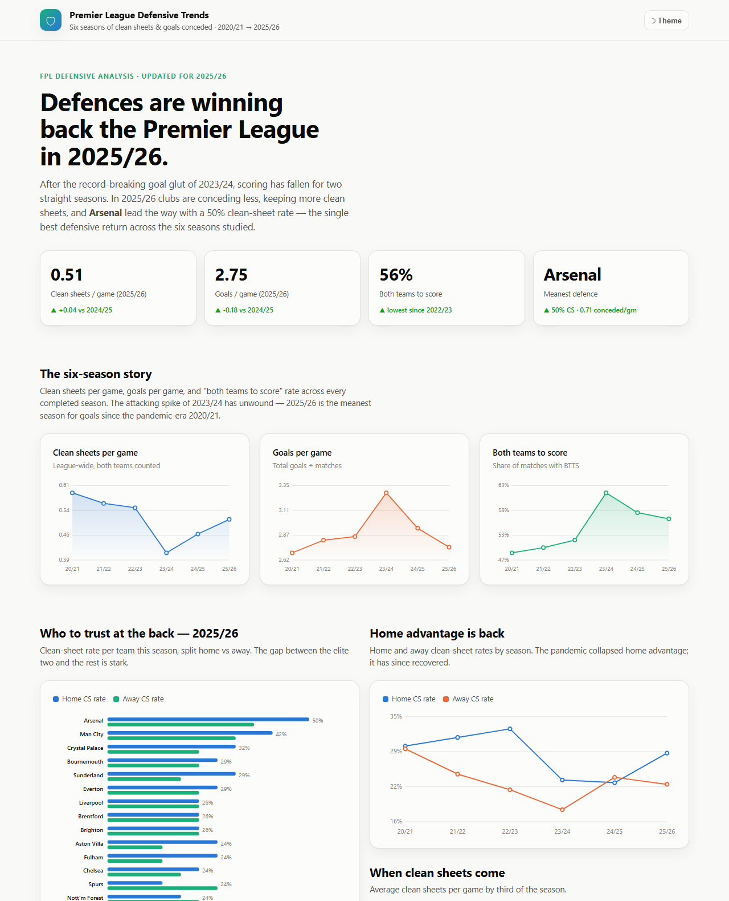
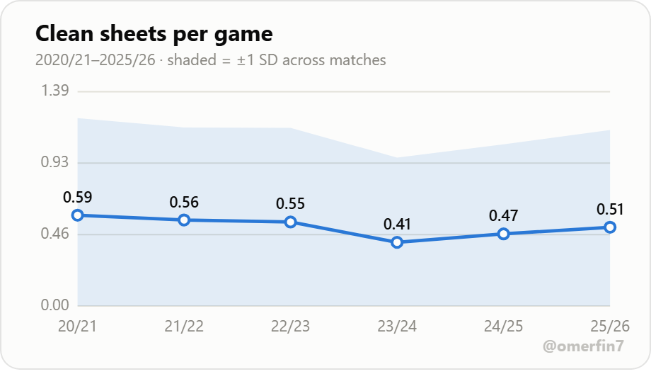
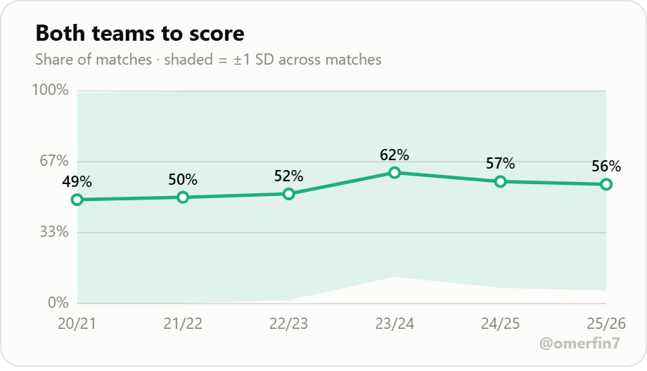
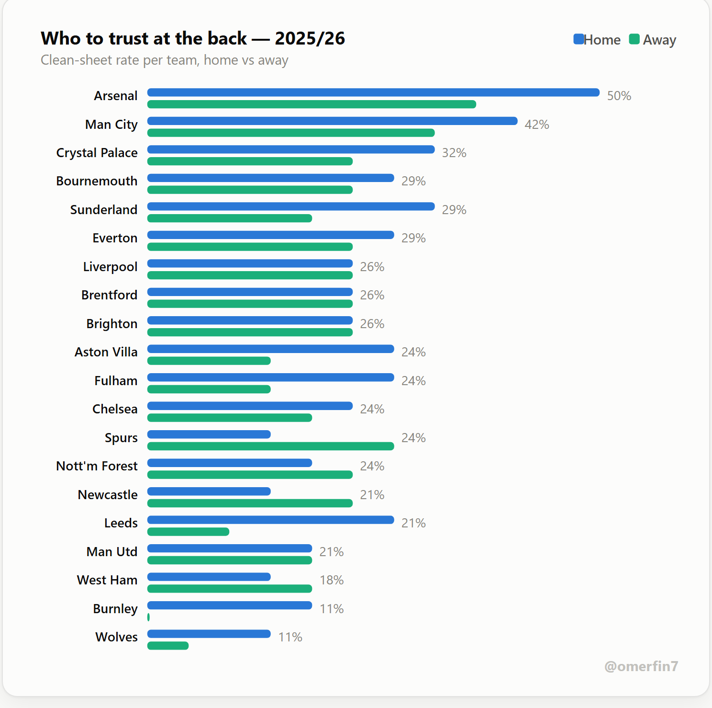
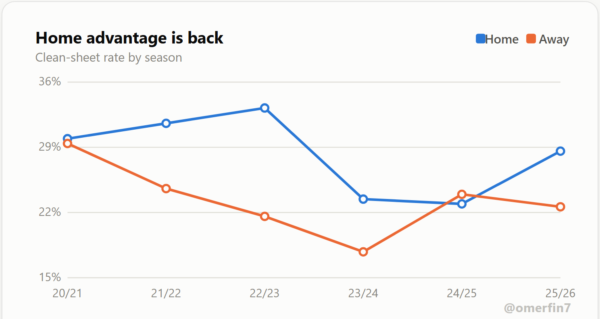
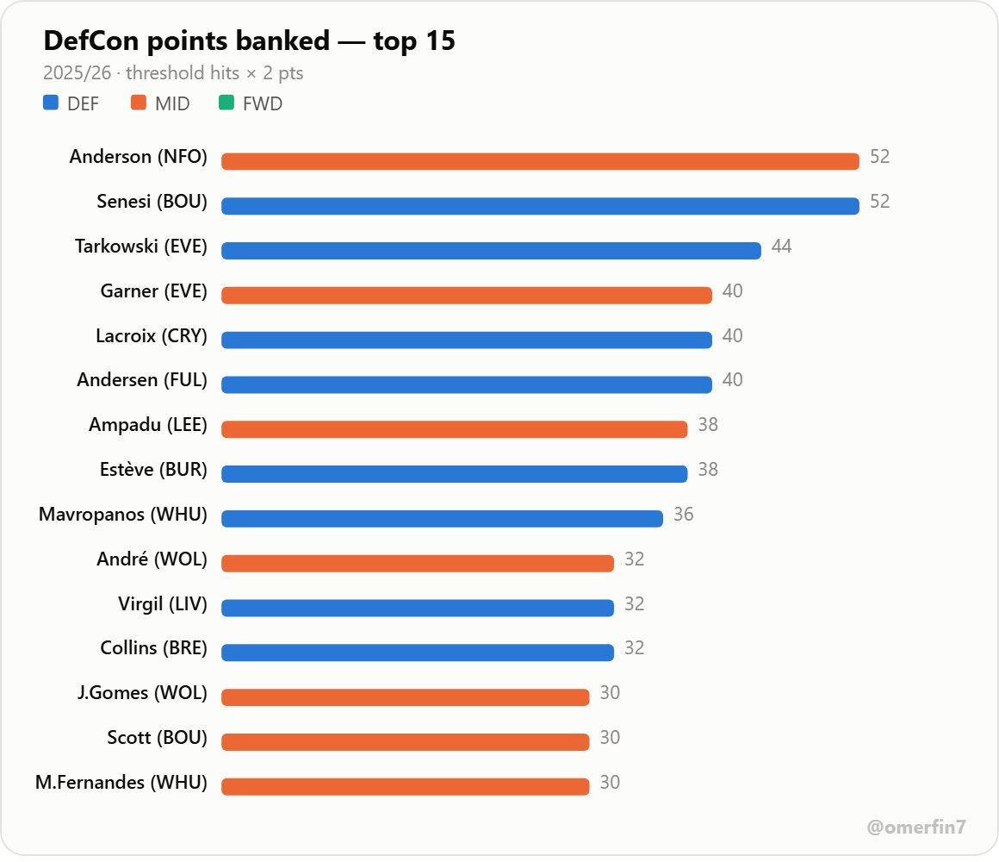
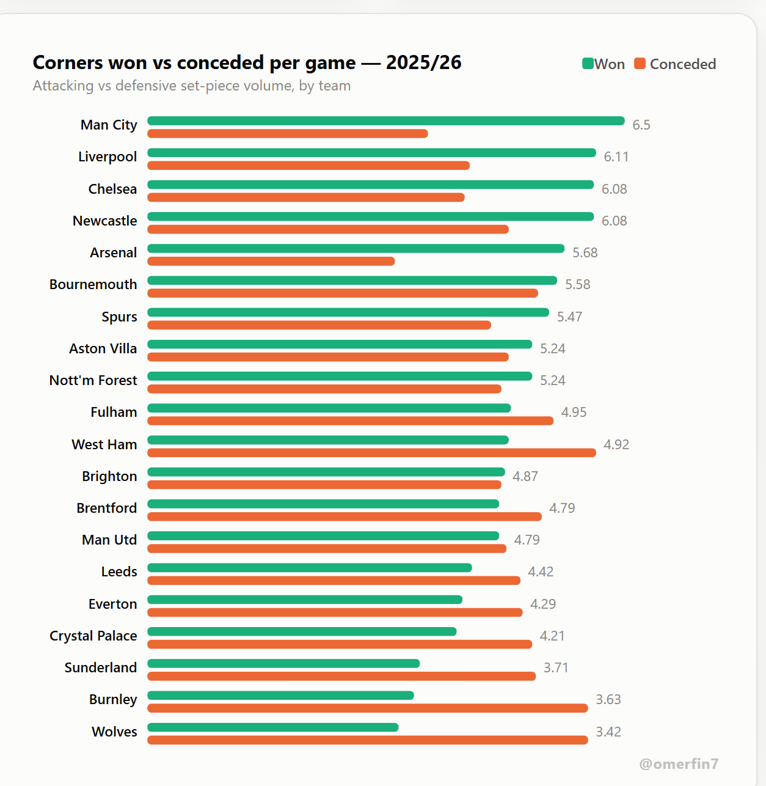

# Premier League Defensive Trends — 2020/21 → 2025/26

A six-season study of **defensive performance in the English Premier League**, built for Fantasy Premier League (FPL) decision-making: clean sheets, goals conceded, home/away splits, and where the best defensive value sits going into and through **2025/26**.

> **Now updated for the 2025/26 season.** All 380 matches of 2025/26 are included.

**➡️ View the interactive dashboard** — download **[`docs/index.html`](docs/index.html)** (open it → **Download raw file**) and open it in any browser. It is fully self-contained and works offline. &nbsp;·&nbsp; [Read the findings report](REPORT.md)

> **Prefer a hosted link?** Enable GitHub Pages once — **Settings → Pages → Source: _Deploy from a branch_ → `main` / `/docs` → Save** — and the dashboard goes live at `https://omerfinzi.github.io/PL_defensive-_trends/` (it 404s until Pages is enabled). The static charts below preview it either way.



---

## Sample visuals

A few charts from the dashboard (each is a self-contained, shareable image). The full set is interactive — with tooltips, a light/dark toggle and sortable tables — in [`docs/index.html`](docs/index.html) (see how to open it above).

| | |
|---|---|
|  |  |
|  |  |

**DefCon points banked — 2025/26 (new player-level metric)**



**Set pieces — corners won vs conceded, 2025/26 (penalties excluded)**



---

## Headline findings (2025/26)

- **Defences are recovering.** After the record goal-glut of 2023/24 (3.28 goals/game, 62% both-teams-to-score), scoring has fallen two seasons running. **2025/26 is the meanest season for goals since 2020/21** — 2.75 goals/game and clean sheets back up to 0.51 per game.
- **Arsenal are the defence to own** — a **50% clean-sheet rate** and just **0.71 goals conceded per game**, the best single-season defensive return in the six-year window. Man City are second (42% CS, 0.92 conceded/gm); after that there's a steep drop-off.
- **Home advantage is back.** The behind-closed-doors era of 2020/21–2021/22 flattened the home edge; it has since recovered — home clean-sheet rate is again clearly above away.
- **Momentum matters.** Biggest defensive *improvers* vs 2024/25: **Brighton (−0.34 conceded/gm)**, Man City, Spurs, Arsenal. Biggest *declines*: **Liverpool (+0.32)**, Chelsea, Newcastle.
- **Promoted-side watch.** **Sunderland** were a genuine defensive surprise (29% CS, 1.26 conceded/gm); Leeds (21%) held up moderately; Burnley struggled (11% CS, 1.97 conceded/gm).
- **DefCon points (new 2025/26 scoring metric).** **Elliot Anderson (NFO)** and **Marcos Senesi (BOU)** tied on a league-leading **52 DefCon points** (26 threshold-hit matches each). Defenders banked **1,642** DefCon points to midfielders' **1,174**; forwards essentially none. The hardest-working defensive squads were **Everton, Bournemouth and Burnley** — often the busier, deeper-defending sides. Best budget value: **Maxime Estève (BUR, £3.8m)** and **Senesi** at ~10 DefCon points per £m.
- **Set pieces (corners & free kicks, penalties excluded).** **Man City** won the most corners (6.5/game); **West Ham** faced the most (6.11/game). League-wide corners have held steady (~10 per match across six seasons). Designated set-piece specialists doing *both* corners and direct free kicks include **Rice (Arsenal)**, **Ward-Prowse (Burnley)**, **Reece James (Chelsea)**, **Bruno Fernandes (Man Utd)** and **Bowen (West Ham)**.

Full numbers and charts are in the dashboard ([`docs/index.html`](docs/index.html)) and [REPORT.md](REPORT.md).

---

## What's in the repo

```
data/                 six season match-results CSVs (epl-2020.csv … epl-2025.csv)
data/fpl_2025_26/      player-level FPL source for DefCon + set-piece takers
data/football_data/    football-data.co.uk CSVs (corners, six seasons)
analyze.py            match-results pipeline → docs/data.json + outputs/
defcon.py             2025/26 DefCon (player-level) pipeline → docs/defcon.json
setpieces.py          set-piece pipeline (corners + takers) → docs/setpieces.json
build_dashboard.py    builds the self-contained docs/index.html from the JSONs
docs/index.html       the interactive dashboard (GitHub Pages entry point)
docs/data.json        league/team metrics consumed by the dashboard
docs/defcon.json      player-level DefCon metrics
docs/setpieces.json   set-piece corners + takers
outputs/              team_season_defence.csv (tidy per-team-per-season table)
REPORT.md             written findings report
.claude/skills/       project skill describing the data sources
```

## Reproduce it

Requires Python 3 with `pandas` and `numpy`.

```bash
pip install pandas numpy
python analyze.py          # league/team trends   -> docs/data.json + outputs/
python defcon.py           # 2025/26 player DefCon -> docs/defcon.json
python setpieces.py        # set pieces (corners+takers) -> docs/setpieces.json
python build_dashboard.py  # rebuilds docs/index.html from the JSONs
```

Open `docs/index.html` in any browser — it is fully self-contained (data embedded inline, **zero external requests**, works offline and on GitHub Pages).

## Data sources

- **League & team trends:** [fixturedownload.com](https://fixturedownload.com) — one EPL results CSV per season, identical schema every year, so seasons stay directly comparable. Add a future season by dropping `epl-<startyear>.csv` into `data/` and re-running (the pipeline globs `data/epl-*.csv`).
- **DefCon (player-level, 2025/26):** official FPL season-end stats via the community archive [vaastav/Fantasy-Premier-League](https://github.com/vaastav/Fantasy-Premier-League) (`data/2025-26/`), staged under `data/fpl_2025_26/`. Note: the **live FPL API can't supply a *completed* season's DefCon** — it resets to the new campaign each summer, so historical DefCon must come from the archive.
- **Set pieces:** corner counts (for & against) from [football-data.co.uk](https://www.football-data.co.uk) match data, six seasons; designated corner and direct-free-kick takers from the official FPL set-piece orders. **Penalties are excluded.**

See [`.claude/skills/fpl-def-data`](.claude/skills/fpl-def-data/SKILL.md).

## Method & scope

- A **clean sheet** is credited to a team that concedes zero goals in a match. `CS rate` = clean sheets ÷ matches played.
- League metrics count **both teams per match**; team tables split home and away.
- Season "thirds": Early = GW1–12, Mid = GW13–26, Late = GW27–38.

- **DefCon points:** a player banks **+2 in a match** when defensive contributions hit the threshold — **defenders: 10+** (clearances+blocks+interceptions+tackles); **midfielders/forwards: 12+** (that total plus ball recoveries). Goalkeepers are not eligible. "Hits" = matches reaching the threshold; DefCon points = hits × 2.

**Honest scope note:** the six-season trends use **match results only**. The 2025/26 **DefCon** and **Set pieces** sections add data from **separate, clearly-labelled sources** (official FPL stats; football-data.co.uk corners). Everything is computed directly from those files by [`analyze.py`](analyze.py), [`defcon.py`](defcon.py) and [`setpieces.py`](setpieces.py) — nothing is estimated or invented. On set pieces specifically: corners are open-play volume (**penalties excluded**), and set-piece *takers* are the designated corner/free-kick takers, **not** confirmed scorers — a verified goal-level "goals from set pieces" / set-piece scorer breakdown needs event data (Opta/StatsBomb via FBref/Understat) that was **not reliably accessible** when this was built (FBref 403; Understat served stripped pages), so it is deliberately omitted rather than guessed. Other player metrics (xG/xGA, ownership) also remain out of scope.

---

*Analysis by [@omerfin7](https://github.com/OmerFinzi). Refreshed for 2025/26.*
